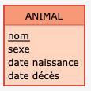
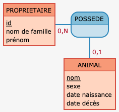
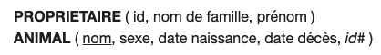

# Construire l'organisation physique des données

⚠️ Rappel : La méthode MERISE

MERISE est une méthode d'analyse et de conception des SI basée sur le principe de la séparation des données et des traitements. 

Elle possède un certain nombre de modèles (ou schémas) qui sont répartis sur trois niveaux :

le niveau conceptuel; ([MCD](http://mocodo.wingi.net/))
le niveau logique ou organisationnel; (MLD)
le niveau physique. (MPD)

Mais la question que tout le monde se pose, c'est :

- OK, j'ai mon MCD, maintenant, ça me sert à quoi ?

Très bonne question !

Effectivement, déjà pour rappel, un MCD permet de faire quoi ? Il permet de définir une entité qui in fine sera transposée en table. Donc, chaque entité est unique (forcément) et possède des attributs.

ex pour un animal : 



Ici, nous avons une entité ANIMAL

et dedans, nous avons des attribus

- nom
- sexe
- date naissance
- date décès

Avez-vous remarqué que le nom était souligné ?

On appelle ça `une clé primaire`. Mais ça veut dire quoi ?

Une clé primaire est un champ unique, généralement, c'est un `id`, mais ça peut être tout et n'importe quoi. Comme ici !

Ensuite, nous avons pour lier 2 entités, une `association`.

En règle général, une association est un verbe.



Comment lire cette cardinalité ?

<details>

```yaml

- Un animal possède au minimum 0 propriétaire, et au maximum 1 propriétaire
- Un propriétaire possède au minimum 0 animal et au maximum plusieurs animaux
```

</details>

## Evoluer du MCD au MLD

### Que veut dire MLD

Le [MLD](https://fr.wikipedia.org/wiki/Merise_(informatique)#MLD_:_mod%C3%A8le_logique_des_donn%C3%A9es) veut dire `Modèle Logique des données`.

Le MLD résulte des relations issues du MCD ainsi que ses relations. 

Donc, à ce stade que savons nous ?

- Qu'il existe des ` clé primaire` (`primary key`)
- Qu'une entité représente in fine une table de notre BDD*
- Qu'une entité est reliée par une `association`
- Et que cette `association` possède des `cardinalité`

Top ! Ça en fait beaucoup, mais ce n'est pas fini.

Et oui, il existe aussi un type de clé, que nous appelons une `clé etrangère` ou `foreign key` en 🇬🇧

Une `clé etrangère` est un attribut d'une relation qui fait référence à la `clé primaire` d'une autre relation

Dans l'ex ci-dessus (avec les cardinalités), voilà comment on les représente

Les `clé primaires` sont représenté avec un souligné
Les `clé etrangères` sont représenté avec un #

### Règle de conversion

Il existe plusieurs règles à connaitre concernant la conversion du MCD vers MLD.

> Règle n°1

**Toute entité du MCD devient une table du MLD**. Les propriétés de ces entités deviennent les colonnes des tables. L'identifiant de l'entité devient la clé primaire de la table.

> Règle n°2

Si l'une des cardinalités max. vaut _1_, **une clé étrangère** est créée du côté de l'entité où se trouve le 1. 

Cette clé étrangère fera référence à l'identifiant dans la table associée.

Dans notre exemple (ANIMAL possède 1 PROPRIETAIRE), c'est donc l'animal qui aura une clé étrangère vers propriétaire.

> Règle n°3

Si les deux cardinalités max. sont _n_, donc une relation _"plusieurs à plusieurs"_ **la relation devient une table à part entière** en relation avec les deux entités. On parle de *table de liaison, d'association, de jonction ou de correspondance*. Cette table de liaison contient 2 clefs étrangères vers les 2 tables à _lier_.

### Écriture

Donc, en se basant ce sur que je viens de dire, nous allons écrire nos MLD

<details>



</details>

## Evoluer du MLD au MPD

Que veut dire MPD ?

- Modèle Physique de données

Ça veut dire quoi ?

C'est assez simple, en fait, c'est limite une formalité après tout ce qu'on vient de faire.

En gros, c'est quoi ?

En s’appuyant sur des règles simples, on va notifier les valeurs de nos attributs avec de réelles valeurs pour notre SGBDR.

Concrètement, cette étape permet de `construire la structure finale de la base de données` avec les différents liens entre les éléments qui la composent.

En résumé :

- Les `entités` se transforment en `tables`
- Les propriétés se transforment en `champs` (ou `attributs`)
- Les propriétés se trouvant au milieu d’une relation génèrent une nouvelle table ou glissent vers la table adéquate en fonction des cardinalités de la relation.
- Les `identifiants` se transforment en clés et se retrouvent soulignés. Chaque table dispose d’au minimum 1 `clé primaire`
- Les relations et les cardinalités se transforment en champs parfois soulignés : il s’agit de créer des « `clés étrangères` » reliées à une « clé primaire » dans une autre table.

### MPD vers SQL

Maintenant que nous avons notre MPD nous pouvons passer au SQL

```sql
CREATE DATABASE IF NOT EXISTS `GET_ANIMALS` DEFAULT CHARACTER SET utf8 COLLATE utf8_general_ci;
USE `GET_ANIMALS`;

CREATE TABLE `PROPRIETAIRE` (
  `id` VARCHAR(42),
  `nom_de_famille` VARCHAR(42),
  `prénom` VARCHAR(42),
  PRIMARY KEY (`id`)
) ENGINE=InnoDB DEFAULT CHARSET=utf8;

CREATE TABLE `ANIMAL` (
  `nom` VARCHAR(42),
  `sexe` VARCHAR(42),
  `date_naissance` VARCHAR(42),
  `date_décès` VARCHAR(42),
  `id` VARCHAR(42),
  PRIMARY KEY (`nom`)
) ENGINE=InnoDB DEFAULT CHARSET=utf8;

ALTER TABLE `ANIMAL` ADD FOREIGN KEY (`id`) REFERENCES `PROPRIETAIRE` (`id`);
```

Par défaut, nous avons les valeurs ci dessus.

Mais nous avons le pouvoir de changer celle ci directement sur le site cité ci dessus

```mcd
PROPRIETAIRE: id, nom de famille[varchar (180)], prénom[varchar (180)]
POSSEDE, 01 ANIMAL, 0N PROPRIETAIRE

:
ANIMAL: nom, sexe, date naissance[datetime], date décès[datetime]
```

## 👨‍🎓 Après la théorie

EXO 1 :

Un employé appartient à un departement
Un département appartient à plusieurs employes

Trouver les entités. 
Une fois trouvé, trouver leurs clé primaire et rechercher les relations potentiels.


EXO 2 :

Un livre est écris par un et un seul auteur
un auteur peut écrire plusieurs livres
Un livre appartient a plusieurs genre

Trouver les entités. 
Une fois trouvé, trouver leurs clé primaire et rechercher les relations potentiels.

EXO 3 : 

Un client peut passer plusieurs commande.
Une commande a un client au minimum.
Un produit concerne plusieurs commandes.

Trouver les entités. 
Une fois trouvé, trouver leurs clé primaire et rechercher les relations potentiels.

Ce qu'il faut savoir :

On reste simple, disons qu'on cherche les éléments de `base` tout en ayant assez d'information (pour un client, ne me donné pas son numéro d'imposition de l'année 2019, ou savoir s'il possède des animaux 😂).

Pour les 3 exercices, je souhaite un MCD / MLD / MPD